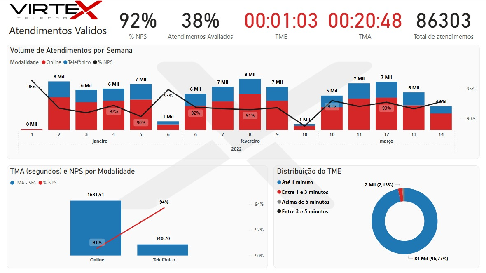

# Desafio de Análise de Dados - (CAC)

**Status:** Concluído 🚀

Este repositório contém a solução completa para o Desafio de Análise de Dados da VirteX, focado na análise de performance da Central de Atendimento ao Cliente (CAC). O objetivo foi extrair dados de múltiplas fontes, tratá-los (ETL), modelá-los e criar um dashboard em Power BI para gerar insights gerenciais sobre os KPIs de atendimento.

---

## 🔧 Tecnologias Utilizadas

* **Visualização de Dados:** Power BI
* **Análise Exploratória (EDA):** Python 3 (Pandas, Matplotlib, Seaborn)
* **Banco de Dados:** SQL (para extração de fontes MySQL)
* **Ambiente:** Jupyter Notebook

---

## 📂 Estrutura do Repositório

Aqui está uma visão geral de como o projeto está organizado:

* **/bi:** Contém o arquivo `.pbix` final e um screenshot da página principal do dashboard.
* **/data:** Contém os arquivos `.sql` com as consultas usadas para extrair os dados das fontes `native` e `smart`.
* **/notebook:** Contém o Jupyter Notebook (`analise_exploratoria.ipynb`) usado para a Análise Exploratória de Dados (EDA) inicial, validação de hipóteses e tratamento.
* **/outputs:** Contém as imagens e gráficos gerados e salvos pelo notebook de análise.
* **`.gitignore`:** Arquivo de configuração para ignorar arquivos sensíveis (como `.env`) e de cache (como `__pycache__`).
* **`.env.example`:** Um arquivo de exemplo para as variáveis de ambiente.
* **`README.md`:** Este arquivo.

---

## 📈 Metodologia e Processo

O projeto foi dividido em 4 etapas principais:

### 1. Extração de Dados (SQL)

As consultas SQL (disponíveis na pasta `/data`) foram usadas para extrair os dados das fontes:
* `native_chamadas_atendidas` (Telefônico)
* `smart_atendimentos` e `smart_pesquisa` (Online)
    * Para a fonte `smart`, foi utilizado um `LEFT JOIN` na própria consulta SQL para otimizar a performance (Query Folding) e trazer os dados da pesquisa já associados aos atendimentos.

### 2. Análise Exploratória (Python)

Antes de carregar os dados no Power BI, foi realizada uma Análise Exploratória (EDA) no Jupyter Notebook (`/notebook/analise_exploratoria.ipynb`). O objetivo foi:
* Validar a qualidade e integridade dos dados.
* Identificar outliers, tipos de dados e valores nulos.
* Gerar visualizações preliminares (disponíveis em `/outputs`) para entender as distribuições de tempo (TMA/TME), a relação Bot vs. Agente e a distribuição das notas de NPS.
* Consolidar os dados em uma tabela "mestra" para validar o cálculo do NPS por agente.

### 3. Modelagem e ETL (Power BI / Power Query)

Esta foi a etapa mais crítica. Dentro do Power BI, foi feita a transformação e modelagem:
* **ETL (Power Query):**
    * Carga das fontes SQL e do CSV `agentes`.
    * **Tratamento de Granularidade:** A informação dos agentes (`Turno`, `Meta NPS`) é mensal, enquanto os atendimentos são diários. A solução foi criar uma chave composta (`mes-ano-agente`) em ambas as tabelas (Fatos e Dimensão) e mesclá-las (Merge) no Power Query.
    * Criação de colunas condicionais para os requisitos do desafio, como as **Faixas de TME** e a classificação de **NPS (Promotor/Neutro/Detrator)**.
* **Modelagem (Esquema Estrela):**
    * Foi criada uma `Agente` (lista única de agentes) e uma `Calendario` (tabela de datas) para atuar como dimensões centrais.
    * As tabelas `native` e `smart` atuam como tabelas Fato, ligadas às dimensões.

### 4. DAX e Visualização (Power BI)

Com o modelo pronto, foram criados os visuais e medidas DAX:
* **Medidas DAX:** Foram criadas medidas flexíveis, como `[Total Atendimentos] = [Atendimentos Native] + [Atendimentos Smart]`, permitindo uma análise consolidada e individual.
* **KPIs:** Cálculo dos principais indicadores (TMA, TME, NPS, % Validade).
* **Páginas do Relatório:** O dashboard foi dividido em 5 páginas lógicas (CAC - Resumo, Agentes, Online, Telefônico, Estatísticas) para facilitar a navegação.

 

---

## 💡 Principais Insights Gerados

A análise permitiu identificar claramente os seguintes pontos:
1.  **TME (Espera) é Excelente:** O TME é um ponto forte da operação. Mais de 95% dos atendimentos (ambos canais) são atendidos em menos de 1 minuto.
2.  **TMA (Atendimento) é o Ponto Crítico:** O TMA consolidado é muito alto (~20 minutos). A análise mostrou que a causa raiz é **100% o canal Online** (com TMA de ~28 min), enquanto o Telefônico é muito eficiente (~6 min).
3.  **NPS é Alto, mas...:** O NPS consolidado (91%) é ótimo. No entanto, há uma **forte correlação negativa com o TMA**. Atendimentos muito longos (mesmo os do canal Online) tendem a gerar notas piores.
4.  **Desempenho de Agentes:** A página "Agentes" permite um *ranking* detalhado, cruzando o NPS e o TMA de cada agente com sua meta mensal, identificando *outliers* que precisam de treinamento.
5.  **Análise de Pico:** A página "Estatísticas" mostra os horários de pico de atendimento (9-10h e 14-16h), permitindo uma melhor gestão da alocação de pessoal.

---

## 🏁 Como Visualizar o Projeto

### Opção 1: Dashboard Interativo (Recomendado)

1.  Navegue até a pasta `/bi/`.
2.  Baixe o arquivo `VirteX.pbix`.
3.  Abra-o no Power BI Desktop.
4.  Caso os dados não carreguem, as consultas SQL para extração estão disponíveis em `/data/`.
5. A versão estável do conector MySQL durante a resolução do case era a [8.0.28](https://downloads.mysql.com/archives/c-net/)

### Opção 2: Análise Exploratória (Contexto)

1.  Navegue até a pasta `/notebook/`.
2.  Abra o arquivo `ead_VirteX.ipynb` (pode ser visualizado diretamente no GitHub).

---

## 👨‍💻 Autor

* **Marcus Oliveira**
* [LinkedIn: linkedin.com/in/marcusvsdo](https://www.linkedin.com/in/marcusvsdo/)
* [Email: marcusvsdo@gmail.com](mailto:marcusvsdo@gmail.com)